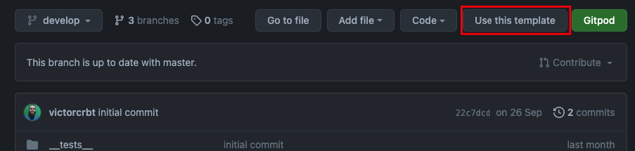

## USAGE

To start using the template, simply click the "**Use this template**" button:



It will create a repository using this one as template.

After that, clone the newly created repository and install the dependencies by running `yarn` or `npm install`.

Then, start the metro bundler by running `yarn start` or `npm run start`, and install on the devices/emulators by running the following commands:

Android

```
yarn android

or

npm run android
```

iOS

```
yarn ios

or

npm run ios
```

## WHAT IS ALREADY INSTALLED?

1. Styled Components with a theme already defined.
2. Navigation with React Navigation.
3. State management with HookState.
4. Icons with React Native Vector Icons (currently only Material and FontAwesome icons. If there is the necessity to use another package of icons, please refrain to the React Native Vector Icons docs.)
5. TypeScript
6. ESLint

From time to time, this template will be updated to add more features that I find useful in a project start.

## PATH ALIASES

To add a new path alias, simply add the path to the `tsconfig.json` file, in the `paths` object following the pattern of the existing ones.

The paths will be automatically mapped on the `babel.config.js` file.

After including a new alias, restart the metro bundler clearing the cache by running one of the following commands:
`yarn start --reset-cache` or `npm run start --reset-cache`.
